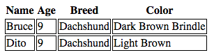

#PHP Fundamentals
####Moving On: Control Flow
#####Conditionals
*Read this material **only if** you understand the previous material*.  This is an example of control flow.  We pose a question that boils down to one of two outcomes: `true` or `false`.
How would we write that in PHP?
```php
<?php
$understand = true;
$practice = true;
if ($understand == true && $practice == true){
  echo "<h1>BRILLIANT!</h1>";
}
else {
  echo "<h1>You must go back and review</h1>";
}
?>
```

#####Looping over Associative Arrays
The `foreach` loop
```php
<?php
$dogs_in_depth = array('Bruce' => [9, 'Dachshund', 'Dark Brown Brindle'], 'Dito' => [9, 'Dachshund', 'Light Brown']);

foreach ($dogs_in_depth as $dog => $dog_info){
  echo "<h1>" . $dog . "</h1>";
  echo "<p>" . var_dump($dog_info) . "</p>";
}
?>
```

####Activity: The var_dump($dog_info) isn't great.  What could we do to expand on our HTML output and make things look nicer?  Keep the foreach loop, but think about how to get a paragraph per detail of each dog.

#####HTML and PHP together
Echoing HTML tags using PHP is bad practice.  We can interleave HTML and PHP.

Example:
```php
// in session2_php_with_html.php file...
<html>
  <head></head>
  <body>
    <h1><?= "HI" ?></h1>
    <p><?php echo "This works too" ?></p>
    <?php if (true) { ?>
      <button>SHOW</button>
    <?php } ?>
  </body>
</html>
```

#####LEMO: Build an HTML Table with dog info!

