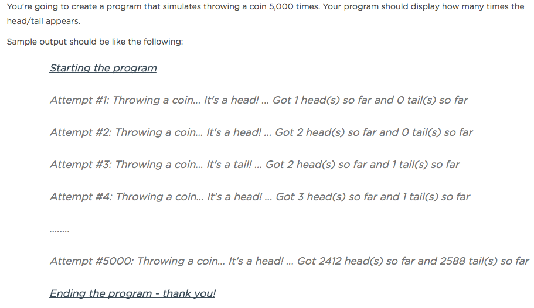

#PHP Fundamentals
####Randoms & Modulo
How might we determine a heads vs a tails? An odd vs an even?

**Randoms**

If a coin flip isn't a head, it's a tail and vice versa correct? What if we could represent that idea in another way?  What if 0 and 1 were our only choices? Works the same way.  You either get a 0 or 1 if you flip a 'number' coin, if you will.

`rand(min, max)` helps us out. If we invoke `rand(0,1)` PHP is going to give us either 0 or 1, similar to the two outcomes of heads and tails.

**Modulo**

For determining if a number is even or odd, we could find out if there's a remainder when dividing by 2.  

So if we say `3 % 2`, we'll get the outcome of `1` because '3 divided by 2' is 1.5, but modulo gives us what's leftover after 2 goes into 3 wholly, which would leave us with 1.

Let's look at another modulo example:
`5 % 2` still gives us `1` because 2 can go into 5 two times and then 5 - 4 leaves us with 1 again.  

Let's try another:
`50 % 30` leaves us with what?

####Activity - Coin Tosses

