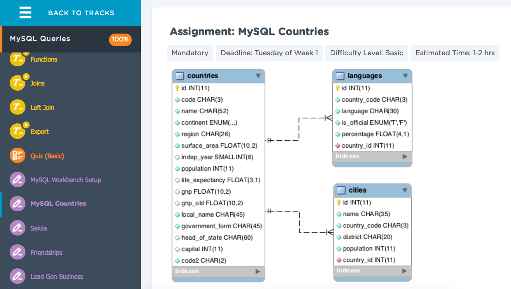

#PHP - MySQL Week
####Forward Engineering our Movies & Actors DB
Forward engineering our ERD means we set our schema in stone (kinda).
We can make changes to the schema later and alter tables, add tables, columns, etc.

####SQL Queries - Using the Movies & Actors DB

####Basic CRUD Operations with a DB
- Create
- Read/Retrieve
- Update
- Delete  

####Let's Do Some CRUD with SQL
- SELECT (Read/Retrieve)
  - Example: ```SELECT * FROM movies```

- INSERT (Create)
  - Example: ```INSERT INTO movies (title, created_at, updated_at) VALUES ('Dr. Strange', NOW(), NOW())```

- UPDATE (Update!)
  - Example: ```UPDATE movies SET title = 'Dr. Strangelove' WHERE title = 'Dr. Strange'```

- DELETE (Delete!)
  - Example: ```DELETE FROM movies WHERE name = 'Dr. Strangelove'```

####JOINS!
- JOIN vs. LEFT JOIN vs. RIGHT JOIN vs. ...

- Let's switch to the World Database.
- Let's find out how we might find the languages that Americans speak.
  - ```SELECT * FROM countries JOIN languages ON countries.id = languages.country_id```
    - Cool! We just slammed the two tables together.  Granted, it's way too much info for us, but we can deal with that.
- WHERE clause helps us add specificity or conditions
  - ```SELECT * FROM countries JOIN languages ON countries.id = languages.country_id WHERE countries.name = 'United States'```
  - Let's hone in on the fields we actually WANT to bring back.
  - ```SELECT countries.name, languages.language FROM countries JOIN languages ON countries.id = languages.country_id WHERE countries.name = 'United States'```

####Lemo - MySQL Countries

- What query would you run to get all the countries that speak Slovene? Your query should return the name of the country, language and language percentage. Your query should arrange the result by language percentage in descending order.
- What query would you run to get all the cities in Mexico with a population of greater than 500,000? Your query should arrange the result by population in descending order.
